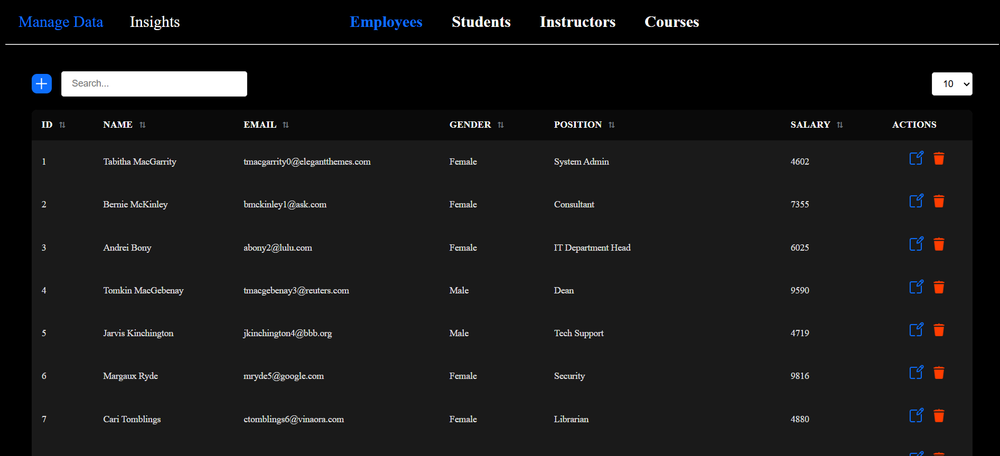
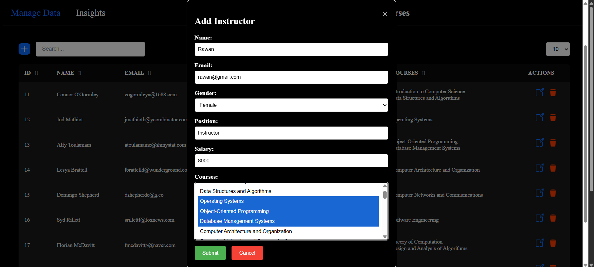
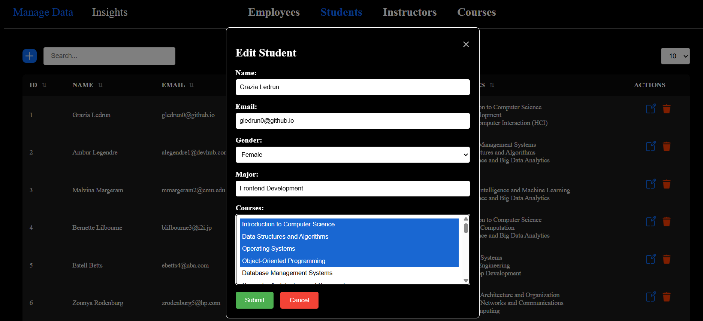
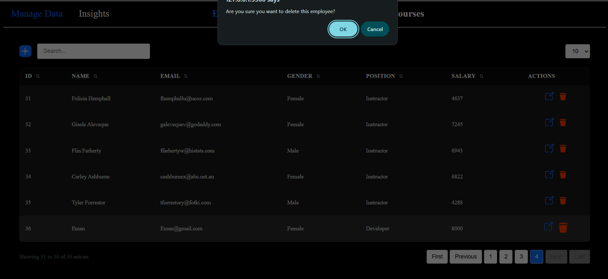
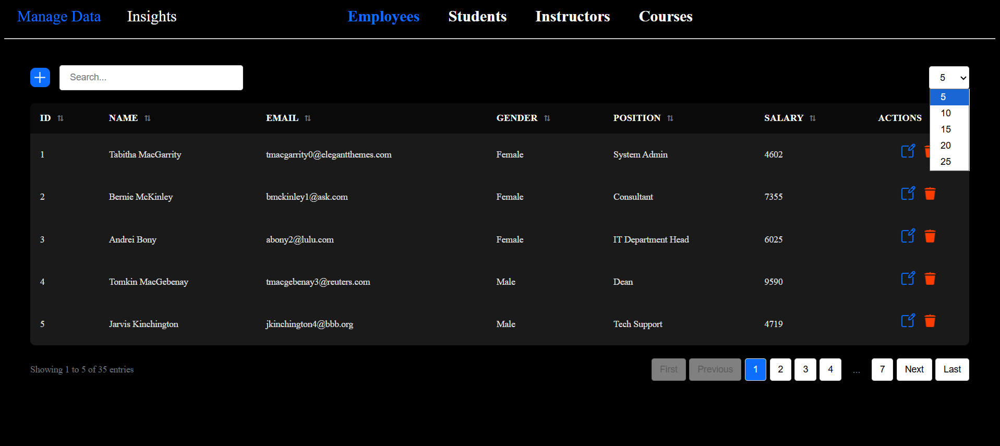
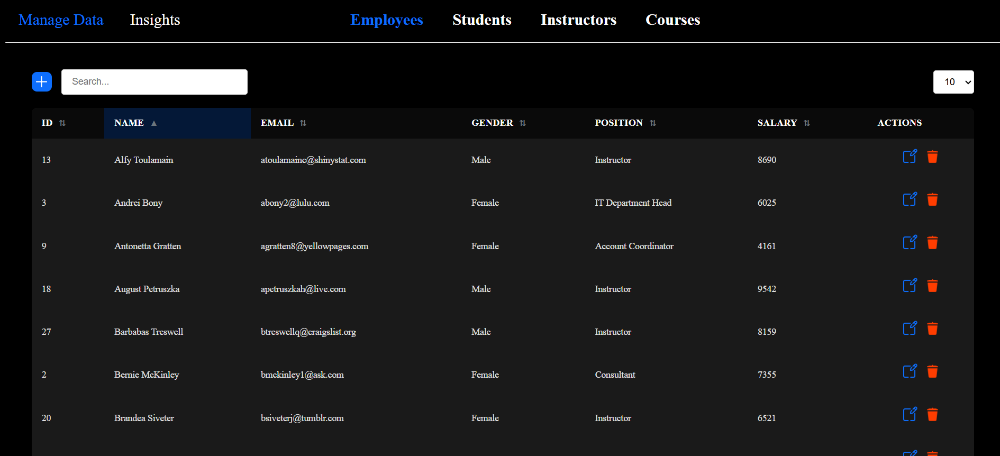
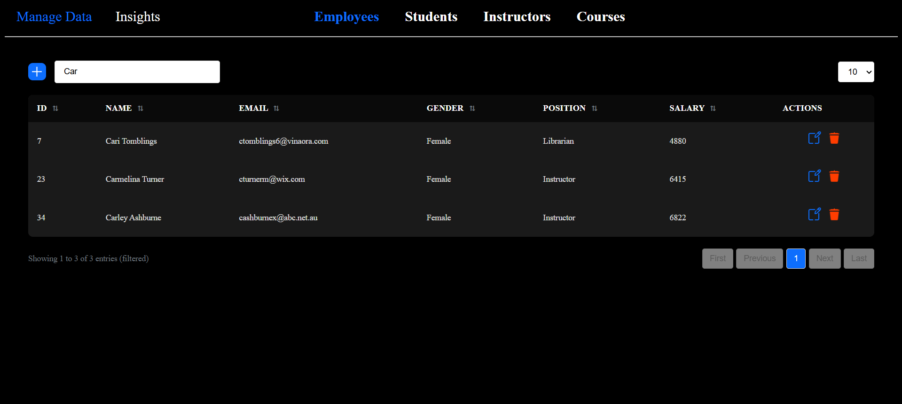
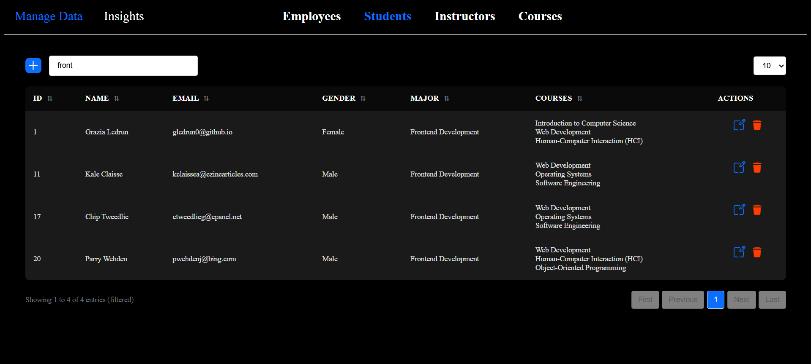
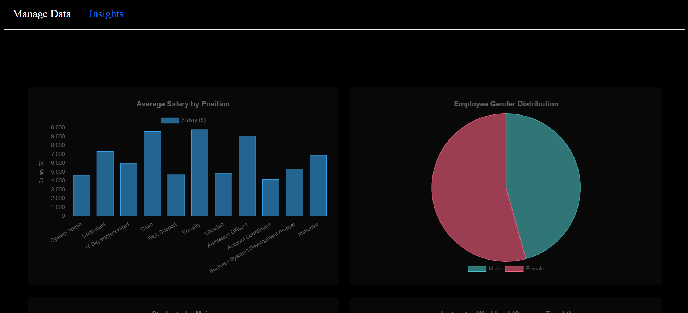
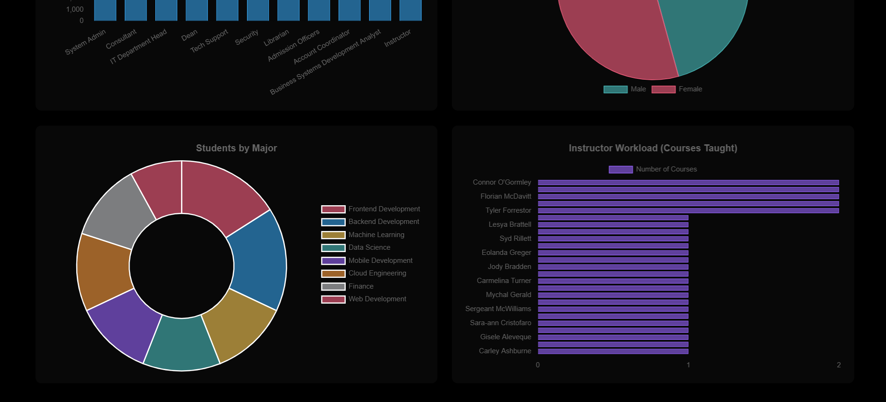

# management system

a simple management system focused on clean architecture and core backend logic rather than ui complexity.

the project demonstrates solid oop design while handling real-world data operations such as crud, pagination, sorting, searching, and controlled user input.

## preview

## features
- dashboard for managing:
  - employees
  - students
  - instructors
  - courses
- full crud operations for all entities
- pagination for large data sets
- sorting and searching
- restricted data input to preserve integrity
  - example: students can only be assigned to existing courses via dropdowns
- data insights and statistics visualized using chartjs

## architecture
- follows oop principles
- clear separation of responsibilities
- entities, logic, and ui concerns kept distinct

## tech stack
- hmtl
- css
- javascript (es6)
- chartjs

## screenshots
- Add new entity
  

- Dropdown menu for courses
  

- Confirm message before deletion
  

- Pagination
  

- Sort by name
  

- Search by Name
  

- Search by Major
  

- Charts
  

